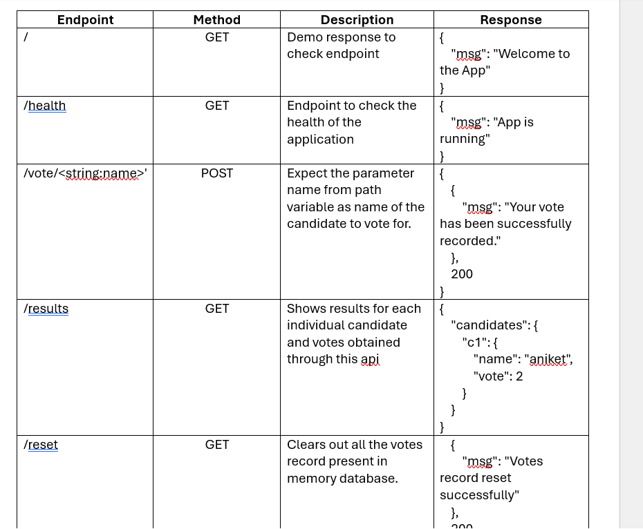
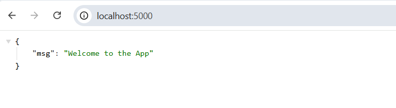
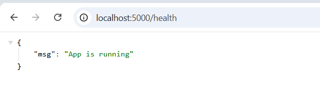
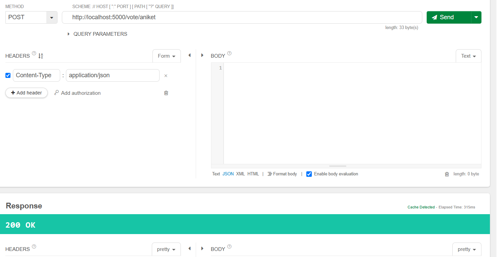
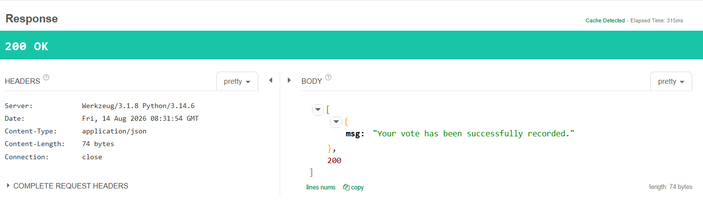
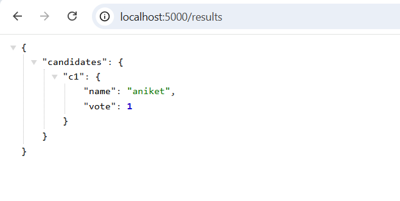
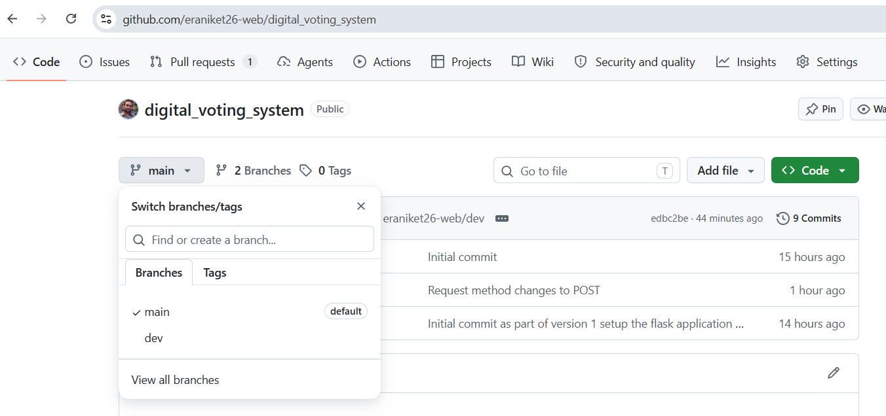
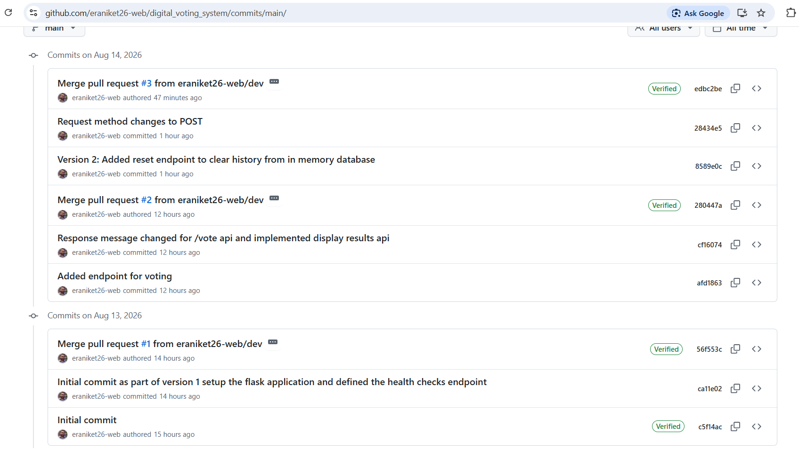

# Digital Voting System
A simple web-based voting application that allows users to view available candidates and cast their vote.
The application keeps track of candidates and their vote counts.
It also provides basic validation to prevent invalid voting actions.
This project was created as a learning project to practice Python programming and build a basic voting application.

# Project Title and Description
Digital Voting System

The Digital Voting System is a demo application that provides a simple way to manage candidates and record votes. Users can view the available candidates and select a candidate to vote for. The application records each vote and provides a response confirming whether the vote was successfully recorded.

This is a demo and learning project and is not intended for use in real-world elections.

# Installation and Setup Steps

1. Clone the Repository
git clone git@github.com:eraniket26-web/digital_voting_system.git

2. Move Into the Project Directory
cd digital-voting-system

3. Create a Virtual Environment
python -m venv venv

4. Activate the Virtual Environment
Windows — Command Prompt
venv\Scripts\activate

Windows — PowerShell
.\venv\Scripts\Activate.ps1

# Install Required Dependencies

pip install -r requirements.txt

#  Run the Application
python app.py
The application will start on the local Flask server.
Open the URL shown in your terminal, typically:
http://127.0.0.1:5000

# API Endpoint Reference

# Git WorkFlow
1.  main — Contains stable and completed versions of the project.
2.  dev — Used for development and testing new features before they are added to main.

    main (Stable code)
     |
     |
     |
     |
     V
    dev
    (Development)
    |
    | (Test & Verify)
    |
    V
   main(Stable code)

  dev branch for implementing and testing new features. Once the changes were completed and verified, they were merged into the main branch.

  # Version History

  The first version focused on the core functionality of the application.
  # Version 1.0 — Basic Voting System

 Included:

1. Basic Flask application setup
2. Candidate creation
3. Candidate listing
4. Basic voting functionality
5. Vote counting
6. Basic validation
7. Voting success response
8. Initial Git repository and branch setup

# Version 2.0 — Improved Voting System

The second version focused on improving the existing functionality and adding new endpoint for reset the entire data for voting

# Application working endpoints

# Git branches 

# Commit History
